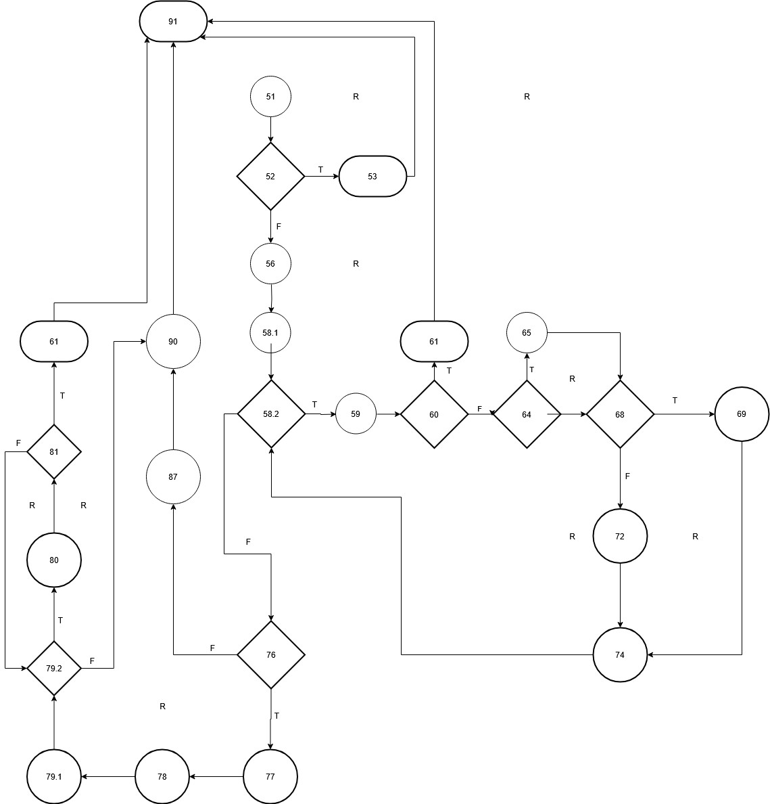

## SI_2025_lab2_236055

# Христијан Павлов 236055

# 2.

# 3.
    Цикломатската комплексност на CFG е 9 и истиот го добив со броење на сите региони во графот
# 4.
    Every Statement 

    Минимално ни се потребни 5 тест случаи за да се постигне Every Statement критериумот 

| Линија код | ТС1 | ТС2 | ТС3 | ТС4 | ТС5 |
|:----------:|:---:|:---:|:---:|:---:|:---:|
|     51     |  *  |  *  |  *  |  *  |  *  |
|     52     |  *  |  *  |  *  |  *  |  *  |
|     53     |  *  |     |     |     |     |
|     56     |     |  *  |  *  |  *  |  *  |
|     58     |     |  *  |  *  |  *  |  *  |
|     59     |     |  *  |  *  |  *  |  *  |
|     60     |     |  *  |  *  |  *  |  *  |
|     61     |     |  *  |     |     |     |
|     64     |     |     |  *  |  *  |  *  |
|     65     |     |     |  *  |     |     |
|     68     |     |     |  *  |  *  |  *  |
|     69     |     |     |  *  |     |     |
|     71     |     |     |     |  *  |  *  |
|     72     |     |     |     |  *  |  *  |
|     76     |     |     |  *  |  *  |  *  |
|     77     |     |     |     |  *  |  *  |
|     78     |     |     |     |  *  |  *  |
|     79     |     |     |     |  *  |  *  |
|     80     |     |     |     |  *  |  *  |
|     81     |     |     |     |  *  |  *  |
|     82     |     |     |     |  *  |     |
|     86     |     |     |  *  |     |     |
|     87     |     |     |  *  |     |     |
|     90     |     |     |     |     |  *  |
    
         checkCart(List<Item> allItems, String cardNumber)

    ТС1: checkCart(null,"")
    ТС2: checkCart({item1(null,1,300,1)},"")
    ТС3: checkCart({item1("name",1,300,1)},null)
    ТС4: checkCart({item1("name",1,300,0)},"a000000000000000")
    ТС5: checkCart({item1("name",1,300,0)},"0000000000000000")
	
# 5.
    Multiple Condition

    Услов: if (item.getPrice() > 300 || item.getDiscount() > 0 || item.getQuantity() > 10)

    Минимално ни се потребни 2^3 = 8 тест случаи за да се постигне Multiple Condition критериумот

| Тест случај | item.getPrice() > 300 | item.getDiscount() > 0 | item.getQuantity() > 10 | Резултат |
|:-----------:|:---------------------:|:----------------------:|:-----------------------:|:--------:|
| ТС1         | False                 | False                  | False                   | False    |
| ТС2         | False                 | False                  | True                    | True     |
| ТС3         | False                 | True                   | False                   | True     |
| ТС4         | False                 | True                   | True                    | True     |
| ТС5         | True                  | False                  | False                   | True     |
| ТС6         | True                  | False                  | True                    | True     |
| ТС7         | True                  | True                   | False                   | True     |
| ТС8         | True                  | True                   | True                    | True     |

         Item(String name, int quantity, int price, double discount)
    
    ТС1: Item("name",1,300,0)
    ТС2: Item("name",11,300,0)
    ТС3: Item("name",1,300,1)
    ТС4: Item("name",11,300,1)
    ТС5: Item("name",1,301,0)
    ТС6: Item("name",11,301,0)
    ТС7: Item("name",1,301,1)
    ТС8: Item("name",11,301,1)

# 6.
    За пишување на unit тестовите ги искористив горенаведените тест случаи, со тоа што за Multiple Condition  требаше да се провери само дадениот услов за cardNumber искористив променлива која во себе содржи валидена вредност
 